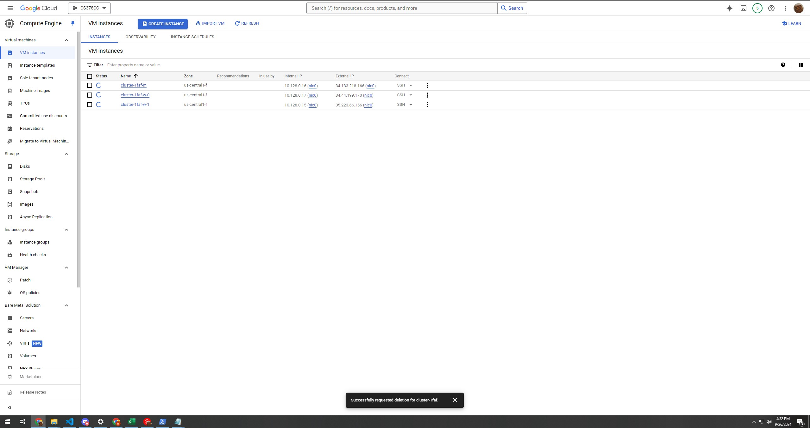
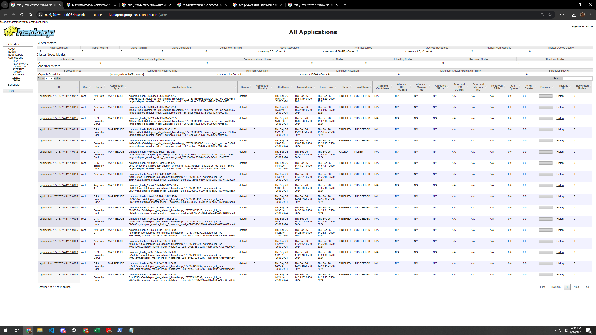
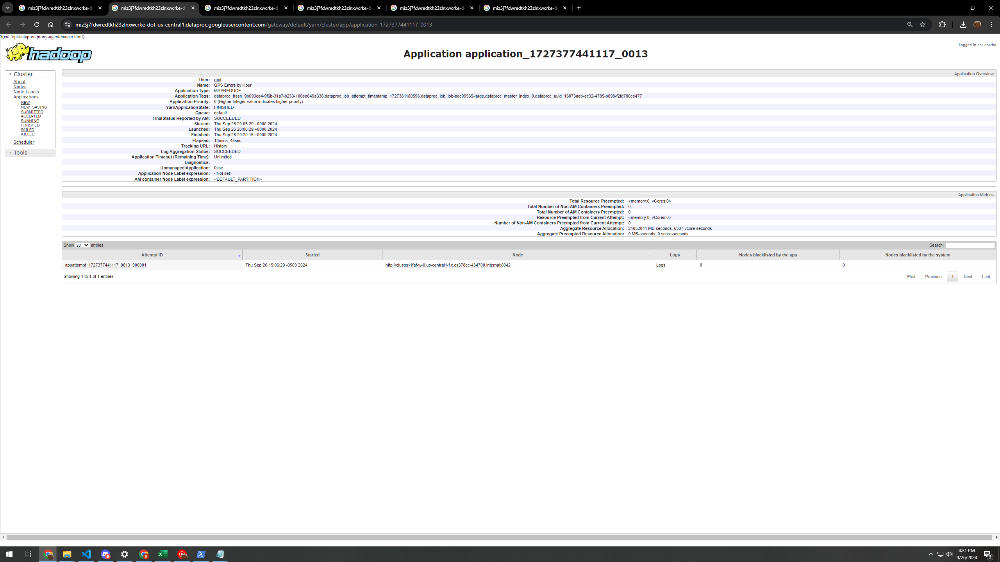
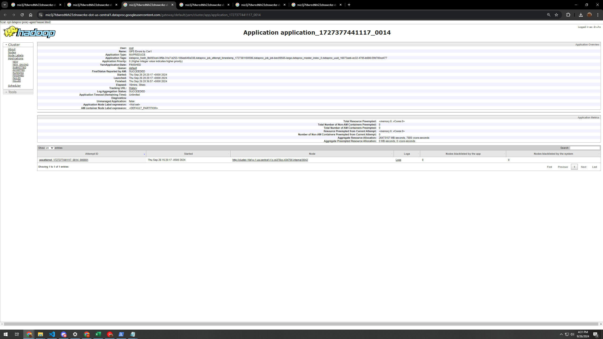
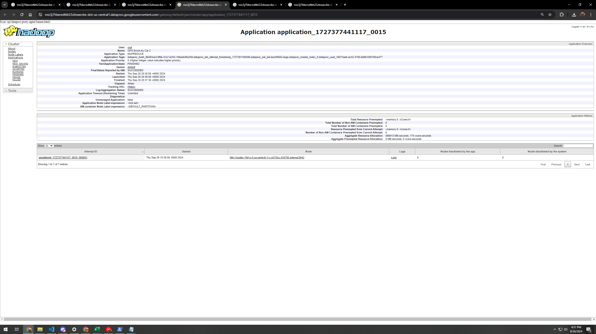
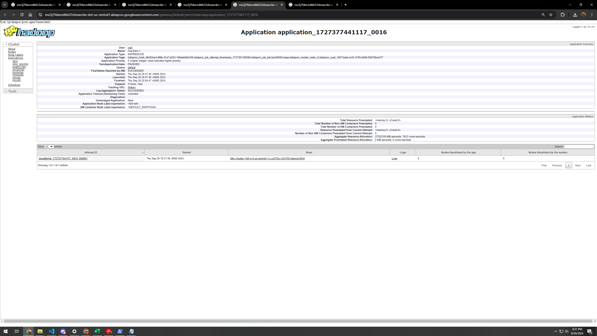
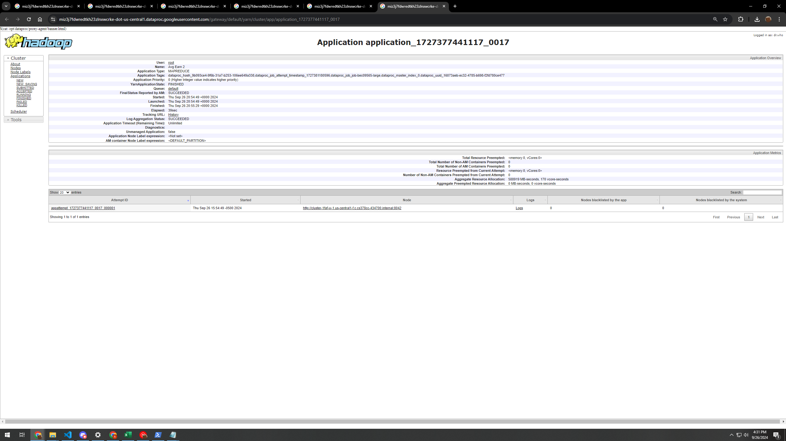

# Please add your team members' names here. 

## Team members' names 

1. Student Name: Rishi Astra

   Student UT EID: raa3897


##  Course Name: CS378 - Cloud Computing 

##  Unique Number: 51515

# Task 1
Hours were rounded up to the range [1, 24] instead of [0, 23] to match spec.

I discard lines that fail any a3 checks.

One thought I had was that the gps errors per hour could be caused by some hours being less popular for taxi rides (like 4-6am).
## Results
```
1	198455
2	149629
3	113354
4	85924
5	63664
6	50864
7	104930
8	180299
9	219760
10	230093
11	223271
12	228705
13	242812
14	241264
15	251164
16	247964
17	215002
18	244770
19	304670
20	317971
21	296602
22	291541
23	279603
24	247435

```

# Task 2
There are at least 5 cars that always have errors in both the small and big datasets.
## Results
```
FE757A29F1129533CD6D4A0EC6034106	1.0
12CE65C3876AAB540925B368E8A0E181	1.0
0EE3FFCBDFD8B2979E87F38369A28FD9	1.0
0D752625D41FAFA8CED8F259651E624C	1.0
0219EB9A4C74AAA118104359E5A5914C	1.0
```

# Task 3
Results may differ from a3 slightly since I used floats instead of ints this time.
## Results
```
E79402C516CEF1A6BB6F526A142597D4	141.81818
FA587EC2731AAB9F2952622E89088D4B	179.99998
28EAF0C54680C6998F0F2196F2DA2E21	179.99998
74071A673307CA7459BCF75FBD024E09	179.99998
42AB6BEE456B102C1CF8D9D8E71E845A	190.71428
95A921A9908727D4DC03B5D25A4B0F62	208.0
E9DA1D289A7E321CC179C51C0C526A73	229.99998
D8E90D724DBD98495C1F41D125ED029A	624.0
A7C9E60EEE31E4ADC387392D37CD06B8	1260.0
FD2AE1C5F9F5FBE73A6D6D3D33270571	4079.9998
```

# Screenshots
There are many jobs shown in Yarn since I had to make a few fixes and re-run. The final results start at the most recent `GPS Errors Per Hour` job.
## Google Cloud


## Yarn






# How to run
Give it the input file, and a parent folder that will hold all outputs, as well as intermediate results
```java -jar target/MapReduce-WordCount-example-0.1-SNAPSHOT-jar-with-dependencies.jar input.txt  output_parent_folder``` 
